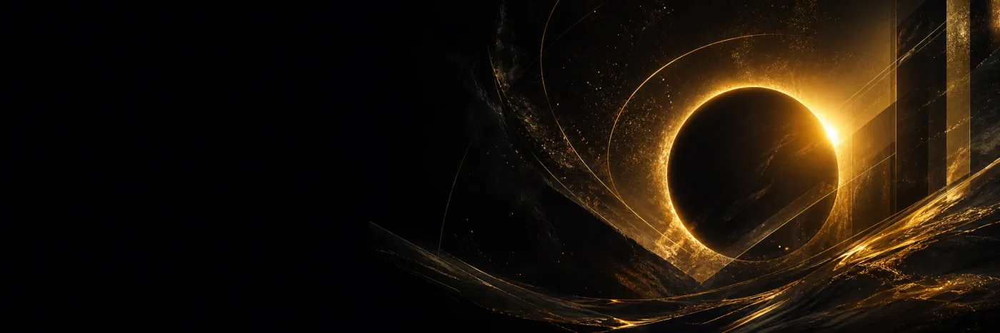

# Codex Dream Skin Themes

8 张可以直接使用的超宽 Codex 主题背景，以及完整可复刻的 AI 提示词。

[](#主题预览)
[](#图片规格)
[](LICENSE)

> **[在线生成自己的 Codex 主题背景](https://image3.org/zh/codex-dream-skin-generator?utm_source=github&utm_medium=readme&utm_campaign=codex_dream_skin)**
>
> 选择主题方向，修改颜色、氛围或视觉主体，生成新的超宽背景。


## 这个仓库提供什么

- 8 张无水印 PNG 主题背景
- 每张尺寸均为 `2172 × 724`，比例 `3:1`
- 深色、浅色、暖色和高对比主题
- 对应的完整生成提示词
- 可机器读取的 [`prompts/themes.json`](prompts/themes.json)

这里只提供背景素材和提示词，不包含安装器，不修改应用文件，也不会更改任何 Codex 配置。

## 主题预览

### Aurora Terminal / 极光终端

[下载原图](themes/aurora-terminal.png) · [在线生成同风格](https://image3.org/zh/codex-dream-skin-generator?theme=aurora-terminal&utm_source=github&utm_medium=theme&utm_campaign=codex_dream_skin)


### Porcelain Bloom / 瓷光花境

[下载原图](themes/porcelain-bloom.png) · [在线生成同风格](https://image3.org/zh/codex-dream-skin-generator?theme=porcelain-bloom&utm_source=github&utm_medium=theme&utm_campaign=codex_dream_skin)


### Solar Forge / 曜金熔炉

[下载原图](themes/solar-forge.png) · [在线生成同风格](https://image3.org/zh/codex-dream-skin-generator?theme=solar-forge&utm_source=github&utm_medium=theme&utm_campaign=codex_dream_skin)



### Retro Future / 复古未来

[下载原图](themes/retro-future.png) · [在线生成同风格](https://image3.org/zh/codex-dream-skin-generator?theme=retro-future&utm_source=github&utm_medium=theme&utm_campaign=codex_dream_skin)


### Jade Circuit / 翡翠回路

[下载原图](themes/jade-circuit.png) · [在线生成同风格](https://image3.org/zh/codex-dream-skin-generator?theme=jade-circuit&utm_source=github&utm_medium=theme&utm_campaign=codex_dream_skin)


### Crimson Orbit / 赤红轨道

[下载原图](themes/crimson-orbit.png) · [在线生成同风格](https://image3.org/zh/codex-dream-skin-generator?theme=crimson-orbit&utm_source=github&utm_medium=theme&utm_campaign=codex_dream_skin)


### Arctic Glass / 冰川玻璃

[下载原图](themes/arctic-glass.png) · [在线生成同风格](https://image3.org/zh/codex-dream-skin-generator?theme=arctic-glass&utm_source=github&utm_medium=theme&utm_campaign=codex_dream_skin)


### Sunset Paper / 落日纸境

[下载原图](themes/sunset-paper.png) · [在线生成同风格](https://image3.org/zh/codex-dream-skin-generator?theme=sunset-paper&utm_source=github&utm_medium=theme&utm_campaign=codex_dream_skin)


## 图片规格

好的主题背景需要服务真实界面，而不是把整张假 UI 盖在窗口上。

| 规则 | 建议 |
| --- | --- |
| 画布 | `2172 × 724` 或其他接近 `3:1` 的超宽尺寸 |
| 左侧安全区 | 左侧约 38% 保持低细节、低干扰 |
| 视觉焦点 | 主要光线、造型或主体放在右半区 |
| 内容限制 | 不生成窗口、卡片、按钮、标签、Logo 和水印 |
| 裁切 | 先生成 21:9，再按实际窗口裁成 3:1 |

## 自己生成一套主题

最快的方法是打开在线生成器：

**https://image3.org/zh/codex-dream-skin-generator**

或者从这个通用模板开始：

```text
Create a production-ready panoramic 3:1 desktop theme background.
Keep the entire left 38 percent calm and low-detail for native interface titles.
Place the main visual focus on the right half.
Pure background artwork only: no UI, no windows, no cards, no people,
no characters, no text, no letters, no logos, and no watermark.
The image must remain usable when center-cropped.
```

在模板前面加上你想要的色彩、材质、氛围和主体即可。仓库中的全部提示词位于 [`prompts/themes.json`](prompts/themes.json)。

## English

This repository contains eight free, watermark-free, ultra-wide Codex theme backgrounds and the prompts used to create them.

- Resolution: `2172 × 724`
- Aspect ratio: `3:1`
- Quiet left-side safe zone
- Right-weighted visual focus
- Background art only — no fake UI

**[Create a custom Codex theme online](https://image3.org/codex-dream-skin-generator?utm_source=github&utm_medium=readme&utm_campaign=codex_dream_skin)**

## Contributing

欢迎提交新的原创背景和提示词。请先阅读 [CONTRIBUTING.md](CONTRIBUTING.md)。

## License

MIT。详见 [LICENSE](LICENSE)。
